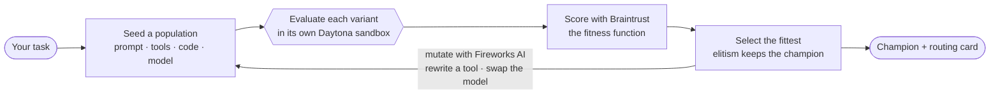
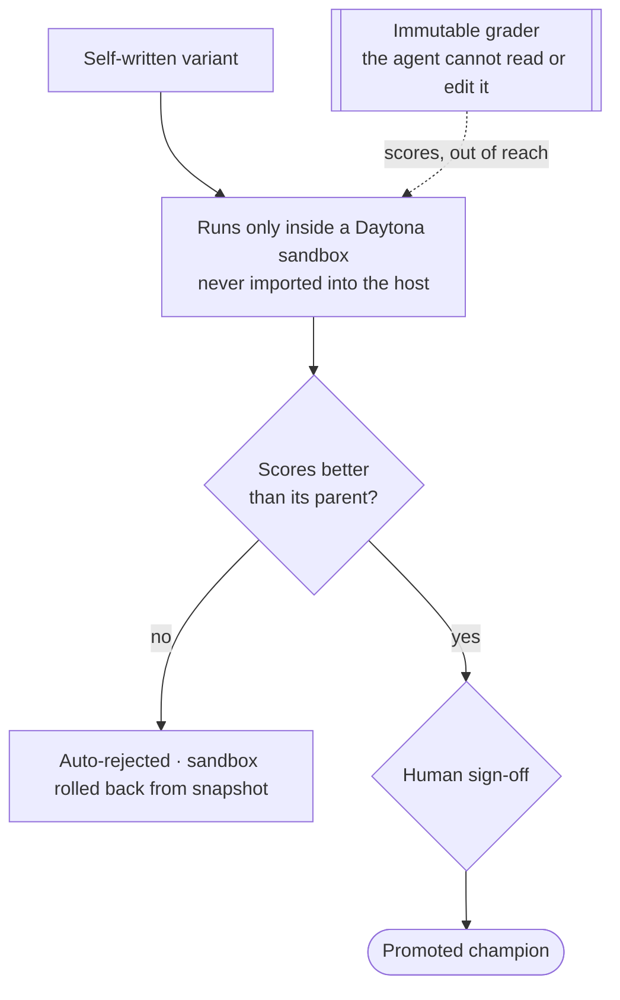

<div align="center">

# Darwin

### It evolves the best whole agent for your task. Safely.

**Give Darwin a task. It evolves the entire agent that solves it, its prompt, its self-written tool code, and the model it runs on, generation over generation, scored by an eval it can't game, inside sandboxes it can't escape. The score climbs while you watch. Point it at a whole domain and it hands back a routing card: the best agent, and model, for each task.**

### [→ Live demo: trydarwin.pages.dev](https://trydarwin.pages.dev)

[](https://trydarwin.pages.dev)
[](https://github.com/KarthikSubramanian07/darwin/actions/workflows/ci.yml)
[](./LICENSE)
[](https://www.python.org/)

`self-improving-ai` · `evolutionary-algorithms` · `genetic-algorithms` · `agentic-ai` · `ai-safety` · `llm` · `llm-evaluation` · `llm-routing` · `sandboxing` · `daytona` · `braintrust` · `fireworks-ai`

</div>

---

## The pitch

Everyone picks one model for everything and hand-tunes one agent for weeks. Both are the wrong unit of work. The thing you actually want is the *best whole agent* for the task in front of you, and you want it to find itself. That is what Darwin does, and the reason nobody ships it (an AI rewriting its own code is a liability no one signs off on) is the exact thing Darwin makes safe by construction.

Darwin treats an agent as a genome: its system prompt, its self-written tool code, its params, **and the model it runs on**. It spawns a population, runs each variant in an isolated Daytona sandbox, scores them with a Braintrust eval that acts as the fitness function, keeps the fittest, and mutates the next generation with Fireworks. The best score climbs, on its own, on screen.

Because the model is just one more gene, self-improvement and model selection are the same act. Point Darwin at one task and watch it climb. Point it at a domain of related tasks and it hands back a **routing card**: the winning agent and model for each one. One product, one loop, one wow.

It is literal natural selection over agents:

- **Variation.** Mutate the agent's tools, prompt, code, and the model it runs on. Fireworks does the mutating, fast and in parallel.
- **Selection.** A Braintrust eval is the fitness function. The score decides who lives.
- **Inheritance.** The fittest seed the next generation.
- **Containment.** Every variant runs in its own isolated Daytona sandbox, and a bad mutation is snapshot-rolled-back on sight.

Generation over generation, the best score climbs. Autonomously. On screen. In real time.

## Why it's different

| You've seen | Darwin |
|---|---|
| **AlphaEvolve** evolves a *program* toward a fixed objective, in a research harness | evolves a whole **agent** (prompt + tools + code + model) as a product you point at your task |
| **DSPy / prompt optimizers** edit the *words* | rewrites the *tools* and swaps the *model*, a strictly larger search space, run in a real sandbox |
| **Model leaderboards / routers** rank models on *generic* benchmarks | evolves the best *whole agent and model* on *your* task, and hands back a routing card |
| **Braintrust / eval tools** *measure* an agent after the fact | uses the eval as *selection pressure*: the score decides which agents survive |
| **ADAS / meta-agent search** optimizes, unconstrained | optimizes **safely**: sandboxed, immutable grader, regression rollback, human veto |

> Prompt optimizers edit the words. Model routers rank models on someone else's tasks. Darwin evolves the best whole agent, prompt, tools, code, and model, on yours. AlphaEvolve is a paper; Darwin runs on your task in three minutes.

## The safety spine

Four guarantees, enforced as code, not slideware:

1. **Sandboxed self-modification.** Every variant executes only inside a Daytona sandbox. Genome code is never imported into the host.
2. **Immutable fitness function.** The grader lives outside the agent's reach. The mutator is never handed the eval. A test enforces it. The agent cannot cheat its own metric.
3. **Regression auto-rejection and rollback.** A variant that scores worse than its parent is killed and its sandbox restored from snapshot. Elitism keeps the champion's score monotonic.
4. **Human veto and a hard compute cap.** No new champion promotes without sign-off, and evolution can't run away.

## Architecture

```
task / domain ──▶ ┌───────────────────────────────────────────────────┐
                  │ EvolutionEngine  init ▸ evaluate ▸ select ▸ mutate │◀─┐
                  └───────────────────────────────────────────────────┘  │
                       │            │             │            │          │
                 Genome pop    Daytona pool   Braintrust   Fireworks      │
                (prompt+tools  (N parallel     (fitness =   (mutation +   │
                 +code+MODEL,   sandboxes,     immutable     model race,  │
                 mutable)       snapshot/      grader)       parallel)─────┘
                                rollback)          │
                                     ▼
        live dashboard: fitness curve · lineage tree · genome diff · task×model grid · routing card
```

Load-bearing sponsors, each used at its frontier: **Fireworks AI** (fast parallel mutation + the model catalog the `model` gene races), **Braintrust** (fitness function, offline eval), **Daytona** (containment, parallelism, snapshot rollback, real execution scoring). Everything else is home-built.

## How a generation works



The best score is monotonic by construction (elitism), so on screen it only ever climbs.

## Why it's safe to run



## Setup

**Prerequisites:** Python 3.11+ and (for the dashboard) Node 20+.

**1. Clone + install**

```bash
git clone https://github.com/KarthikSubramanian07/darwin.git && cd darwin
python -m venv .venv && source .venv/bin/activate
pip install -r requirements.txt
python scripts/build_task.py          # (re)generate the coding benchmark
```

**2. Keys (optional — it runs fully offline without them)**

```bash
cp .env.example .env
# fill in any of these to light up the real sponsors (all independently optional):
#   DAYTONA_API_KEY=      + FEATURE_DAYTONA=1      real sandboxes + rollback
#   BRAINTRUST_API_KEY=   + FEATURE_BRAINTRUST=1   experiments = the fitness fn
#   FIREWORKS_API_KEY=    + FEATURE_FIREWORKS=1    real mutation + the model race
```

**3. Run an evolution (CLI)**

```bash
python -m darwin.main --offline            # ~2s, offline, curve climbs 37.5 -> 100%
python -m darwin.main                       # uses whatever keys/flags are in .env

# point it at a whole domain: decompose an industry, then evolve a specialist per task
python -m pipeline.build legal              # writes data/task/legal.json
python -m darwin.main --task legal
```

**4. The dashboard**

```bash
# terminal 1 — the live engine + WebSocket server
python -m darwin.server.app                 # serves :8000 (offline-safe; add keys for real runs)

# terminal 2 — the dashboard (proxies /ws + /api to :8000)
cd dashboard && npm install && npm run dev  # http://localhost:5173
```

The home page is the pitch + the self-improvement run (the climb, the safety beats). **The Lab** (`/app`) is the interactive routing tool: name a domain, watch the task x model race, get a routing card. **Deploy:** `cd dashboard && npm run build && npx wrangler pages deploy dist --project-name trydarwin`.

**No keys? It still climbs.** With every flag off, Darwin uses a local subprocess sandbox, a local scorer, and canned mutations, and the curve still climbs. That offline path is the demo floor. With keys on, variants run in real **Daytona** sandboxes, mutate and race across the live **Fireworks AI** catalog, and every variant is logged as a **Braintrust** experiment.

## License

[MIT](./LICENSE) © Karthik Subramanian

<div align="center"><sub>The score climbing is the hook. The tool it rewrote in itself is the proof. The sandbox it can't escape is the close.</sub></div>
